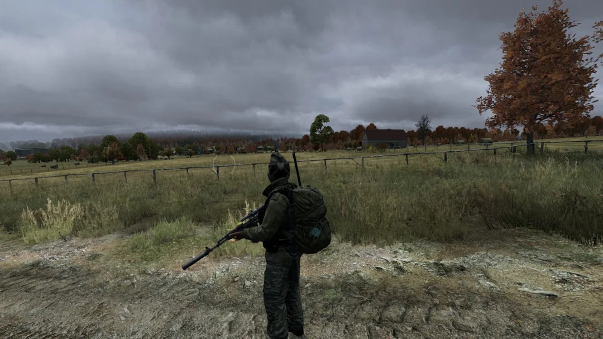
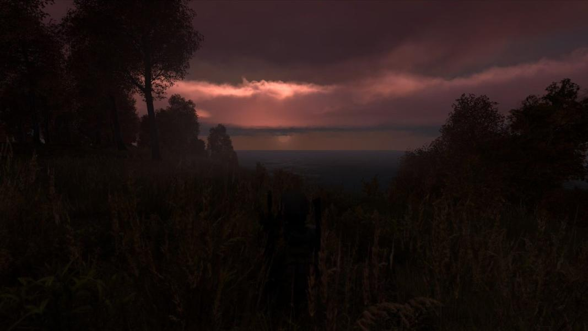

<head>
  <meta name="twitter:card" content="summary_large_image" />
</head>

The project relaunches with a fresh coat of paint, new community resources, and many crash fixes and stability improvements. 

<!--truncate-->

## Release Info

This month's DayZ Legacy release is `0.69.00200`.

  

    <LauncherDownloadLink />
  

:::danger
NOTE - You must be using the latest launcher version to download and play this new update.
:::

## Highlights

### Massive launcher overhaul 

Our launcher has been overhauled in several significant ways:
- You can now pre-select your preferred game settings and save them - this allows you to choose between x86-64, DX9/DX11, etc.
- The settings window appears on first launch and can be re-opened by selecting the "Game Options" button on the launcher window
- This window also includes several options such as resetting your game configuration, automatically packing debug logs, etc. 
- Improved download speeds and reliability 

If you've been having issues setting launch parameters, determining which executable to use, or sending debug logs to us, the new launcher will help you a lot.

We're still fixing some issues with the launcher, including inaccurate progress bars, UI issues, Steam authentication errors, and more, so be patient with us and continue to report any bugs you may run into.

The game will not start anymore unless it is run through the launcher so remember to use it from now on.

A more detailed readme for the launcher is available [here.](https://github.com/DayZLegacyDev/DayZ-Legacy-Launcher)

### Server status bot

Our Discord now has a #server-status channel which provides real-time status updates for the servers we have available.

The game client knows the address of every server and will show whichever one is currently active, but if you run into issues seeing the server, you can always verify by checking this new channel.

Most of the time we will have at least one online.

### Clouds make a return 

We've decided to re-enable volumetric clouds, which can provide much more atmosphere at the cost of performance. Right now, these clouds will only work on the x86 DX9/Vulkan builds (this is currently the launcher default.)

If you notice any issues with clouds, please report them so we can investigate!

We have a few different fixes for increased performance coming soon, as well as support for DX11 and x64 builds. 

### (WIP) Vehicle aimspaces

Starting with the UH1H helicopter variants, an additional player will be able to enter the helicopter as a gunner. This attaches the player outside of the vehicle while allowing them to retain their ability to shoot.

Makes for some fun interactions in both PVE and PVP. 

Our first implementation is more focused on getting the tech working smoothly and making sure the server can handle transporting other characters outside of the vehicle. This can sort of be an intense operation so some desync is to be expected.

Proper character alignment and gunner poses will come later on. It'll look kind of weird for now but definitely report bugs if you run into them.

### Discord Rich Presence

When playing DayZ Legacy, your Discord status will update accordingly, and will even tell your friends if you're currently on a server or in the main menu.

We want to update this over time to keep track of things like killed zombies/players and potentially even allow others to join your session directly from Discord.

### Vulkan client revisions

We've increased performance and quality-of-life while bundling this client into the existing DX9 client, reducing the overall download size.

### Status HUD improvements

We've fixed some lingering formatting issues with the DayZ-mod style status HUD.
- The fracture icon should now show at the top, and the icon should be bigger.
- Money indicator is now located on the bottom to save screen real-estate. 
- Alignment of elements has been improved.

This HUD isn't for everybody, so it remains toggleable in the player menu. 

### Damage processing overhauls

We're finally starting to implement damage on a caliber-specific level and including armor and insulation values into the total damage value.

This is coupled with a new event handler for shock which aims to be a little bit more realistic and make combat more interesting. Getting shot or mobbed by zombies is painful and the player should feel that pain more than they do now. Eventually, adding things like viewport vignetting with higher shock values and injured states will be added to this system.

The end goal here is to prevent the character from tanking .308 rounds to the chest unless they have top-tier armor. We're really aiming for an experience similiar to modded DayZ Standalone servers like Rearmed, with several tiers of chest and head armor.

More advanced medical interventions also become possible with this new system, including things like tourniquets to prevent bleeding for a set amount of time, IFAKs to instantly restore health, ALU splints, and Golden Stars to prevent shock pass-out from a broken limb.

We're tracking down some remanining issues with our first implementation of this system, and there may be times where you just don't go unconscious at all, so keep in mind this is a heavy work in progress still.

We've also begun to implement some very basic logic for vehicle damage handling, which you may notice while driving - we can now detect collisions and your screen will go white if you run into something. Currently, you won't take damage, but we are considering adjusting this in the near future.

### New Low-End mode

A new launch parameter, `-lowEnd` has been added. When selected, the visual fidelity of the game is significantly reduced in an effort to make the game run better.

This mode will put the player at an inherent disadvantage due to reduced visibility and really should only be used on extremely old hardware. 

Not recommended for most users.

### Better Steam integration

Your in-game UID is now determined by your STEAM64 ID, which allows us to better track bans and make them more permanent.

### Loot spawning improvements
Some changes have been made to the world loot processing system which are meant to have the following effect:
- Create a better diversity of weapons, food, and high-tier gear 
- Better distribution of loot through a "minimum-spawn-per-building" requirement

The changes we've made seem to have a positive impact on the overall loot economy and they will be tested in this patch.

Previously, scenarios could occur where only 3/10 "Civilian" weapon types are spawning etc. and this should be reduced now. 

### Improved memory management

If you've ever encountered an "Out of Memory" error while playing, this update should significantly reduce the frequency in which this occurs.

### Scene loading improvements

A good majority of the crashes we currently experience in game are related to how the engine processes and loads shapes, particularly within the level-of-detail system.

We've made some improvements to how the scene is rendered and a lot of the crashes have disappeared.

### Improved crash handling 

We've been wanting to add some more context for the player when the game crashes to the desktop. 

This next update, in some instances where the game crashes, a new dialog will appear informing the user that the game has exited in an unusual manner.

Eventually, we want to have this window show any time the game crashes or exits unexpectedly. 

Once the window appears, you'll be given some additional info such as the exit code, and given the option to create a new bug report directly through the Discord.

### Other changes

We've addressed some ongoing issues with server performance and we think that we've dialed it into a more acceptable range. 

This should hopefully reduce instances of "frozen" character interactions e.g. getting stuck eating/drinking, or other symptoms like lagging zombies/players.

### What build should I use?

The recommended build for this update is the x86 DXVK build. It is selected as the current default in the launcher. This build provides good stability and performance, as well as the full range of graphical options you would expect (new clouds, ambient occlusion)

Our x64 builds can provide faster loading times in some cases at the expense of stability, right now, they're not really worth messing around with. 

We've included x86-64 builds for DX9 and DX11 - Vulkan is now handled directly through the DX9 build using the `-vulkan` parameter. The launcher takes care of this for you when you select "Vulkan" in the game options window.

### What's next? 

After we make sure this update launches smoothly, we're full speed ahead on the next monthly release. 
 
Moving forward, I want to try and have a new progress report out on a monthly basis, which should release around the same time as the monthly game update. We're also going to be making a larger effort to utilize this website for community resources like the launcher download. 

Over the next couple of months, I'm going to be working on some documentation pages here that will help you troubleshoot common issues. We remain active in our community Discord and encourage any new or interested players to join ASAP.

Thanks for reading and see you in Chernarus!

