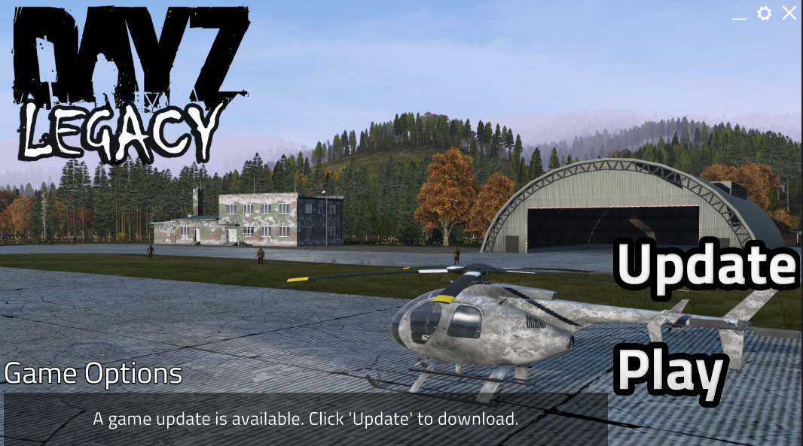
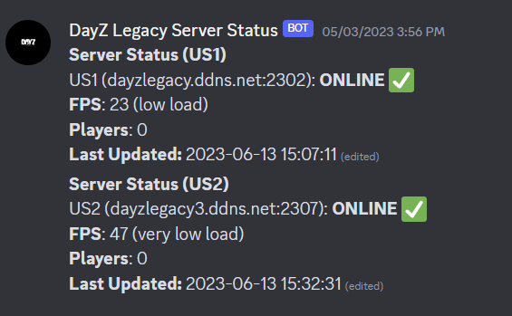
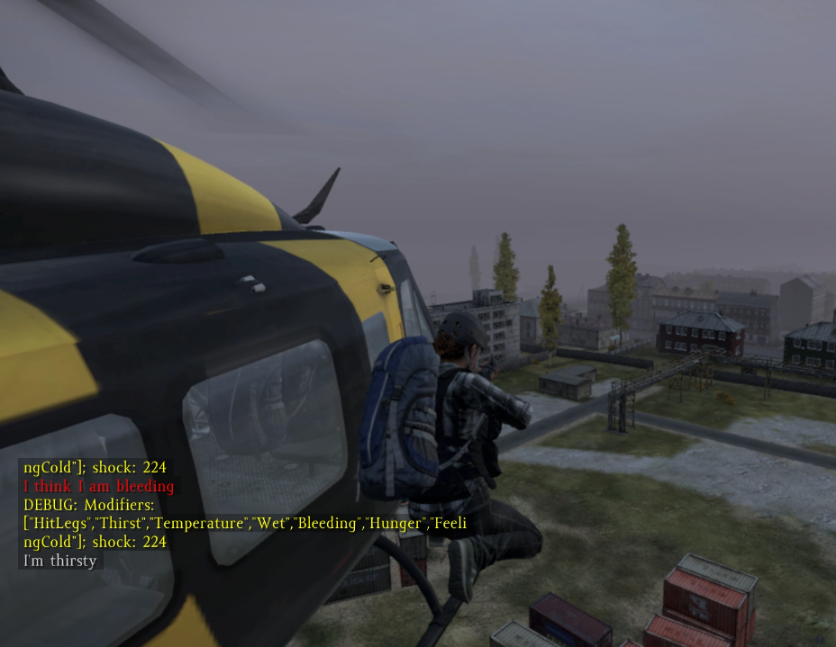
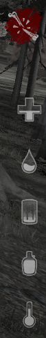

<head>
  <meta name="twitter:card" content="summary_large_image" />
</head>

The project relaunches with a fresh coat of paint, new community resources, and many quality-of-life fixes.

<!--truncate-->

## Release Info

This month's DayZ Legacy release is `0.68.75420`.

  

    <LauncherDownloadLink />
  

:::danger
NOTE - You must be using the latest launcher version to download and play this new update.
:::

## Highlights

### Massive launcher overhaul 

Our launcher has been overhauled in several significant ways:
- You can now pre-select your preferred game settings and save them - this allows you to choose between x86-64, DX9/DX11, etc.
- The settings window appears on first launch and can be re-opened by selecting the "Game Options" button on the launcher window
- This window also includes several options such as resetting your game configuration, automatically packing debug logs, etc. 
- Improved download speeds and reliability 

If you've been having issues setting launch parameters, determining which executable to use, or sending debug logs to us, the new launcher will help you a lot.

We're still monitoring some ongoing issues with the launcher, including inaccurate progress bars, UI issues, Steam authentication errors, and more, so be patient with us and continue to report any bugs you may run into.

The game will not start anymore unless it is run through the launcher, so please remember to use it from now on.

A more detailed readme for the launcher is available [here.](https://github.com/DayZLegacyDev/DayZ-Legacy-Launcher)

Over time, we want to more closely integrate the launcher experience with the game, including allowing the user to pick things like their preferred monitor and even graphical settings like MSAA/texture quality. 

### Server status bot

Our Discord now has a #server-status channel which provides real-time status updates for all 3 DayZ Legacy servers.

The game client knows the address of all 3 servers and will show whichever one is currently active, but if you run into issues seeing the server, you can always verify by checking this new channel.

Most of the time we will have at least one online.

### (WIP) Vehicle aimspaces

Starting with the UH1H helicopter variants, an additional player will be able to enter the helicopter as a gunner. This attaches the player outside of the vehicle while allowing them to retain their ability to shoot.

Makes for some fun interactions in both PVE and PVP. 

Our first implementation is more focused on getting the tech working smoothly and making sure the server can handle transporting other characters outside of the vehicle. This can sort of be an intense operation so some desync is to be expected.

Proper character alignment and gunner poses will come later on. 

### Discord RPC 

When playing DayZ Legacy, your Discord status will update accordingly, and will even tell your friends if you're currently on a server or in the main menu.

We want to update this over time to keep track of things like killed zombies/players and potentially even allow others to join your session directly from Discord.

### Vulkan client revisions

We've increased performance and quality-of-life while reducing the overall download size in this latest round of Vulkan fixes.

<ImageCompare left={require("./img/vulkan-before.png").default} right={require("./img/vulkan-after.png").default}/>

### Status HUD improvements

We've fixed some lingering formatting issues with the DayZ-mod style status HUD.
- The fracture icon should now show at the top, and the icon should be bigger.
- Money indicator is now located on the bottom to save screen real-estate. 
- Alignment of elements has been improved.

This HUD isn't for everybody, so it remains toggleable in the player menu. 

### Damage processing overhauls

We're finally starting to implement damage on a caliber-specific level and including armor and insulation values into the total damage value.

This is coupled with a new event handler for shock which aims to be a little bit more realistic and make combat more interesting. Getting shot or mobbed by zombies is painful and the player should feel that pain more than they do now. Eventually, adding things like viewport vignetting with higher shock values and injured states will be added to this system.

The end goal here is to prevent the character from tanking .308 rounds to the chest unless they have top-tier armor. We're really aiming for an experience similiar to modded DayZ Standalone servers like Rearmed, with several tiers of chest and head armor.

More advanced medical interventions also become possible with this new system, including things like tourniquets to prevent bleeding for a set amount of time, IFAKs to instantly restore health, ALU splints, and Golden Stars to prevent shock pass-out from a broken limb.

We're tracking down some remanining issues with our first implementation of this system, and there may be times where you just don't go unconscious at all, so keep in mind this is a heavy work in progress still.

### New Low-End mode

A new launch parameter, `-lowEnd` has been added. When selected, the visual fidelity of the game is significantly reduced in an effort to make the game run better.

This mode will put the player at an inherent disadvantage due to reduced visibility and really should only be used on extremely old hardware.

### Better Steam integration

Your in-game UID is now determined by your STEAM64 ID, which allows us to better track bans and make them more permanent.

We have a trust factor system we've established based on a number of different criteria.

Another reminder that we're committed to preserving integrity in the game and we won't tolerate cheaters. 

### Loot spawning improvements
Some changes have been made to the world loot processing system which are meant to have the following effect:
- Create a better diversity of weapons, food, and high-tier gear 
- Better distribution of loot through a "minimum-spawn-per-building" requirement

The changes we've made seem to have a positive impact on the overall loot economy and they will be tested in this patch.

Previously, scenarios could occur where only 3/10 "Civilian" weapon types are spawning etc. and this should be reduced now. 

### Improved memory management

If you've ever encountered an "Out of Memory" error while playing, this update should significantly reduce the frequency in which this occurs.

### Scene loading improvements

A good majority of the crashes we currently experience in game are related to how the engine processes and loads shapes, particularly within the level-of-detail system.

We've made some improvements to how the scene is rendered and early testing shows good results. Since our fix is intended to address the issue at the root cause rather than a "band-aid", it has the benefit of both increasing performance and reducing crash frequency.

### Improved crash handling 

We've been wanting to add some more context for the player when the game crashes to the desktop. 

This next update, in some instances where the game crashes, a new dialog will appear informing the user that the game has exited in an unusual manner.

Eventually, we want to have this window show any time the game crashes or exits unexpectedly. 

Once the window appears, you'll be given some additional info such as the exit code, and given the option to create a new bug report directly through the Discord.

The client will still experience crashing and instability so we think this is a good way to get ahead of that and to make the experience a bit less frustrating. 

### Other changes

We've addressed some ongoing issues with server performance and we think that we've dialed it into a more acceptable range. 

This should hopefully reduce instances of "frozen" character interactions e.g. getting stuck eating/drinking, or other symptoms like lagging zombies/players.

