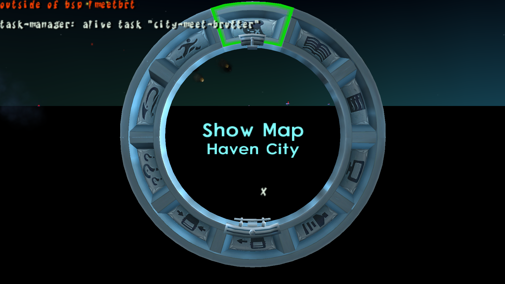
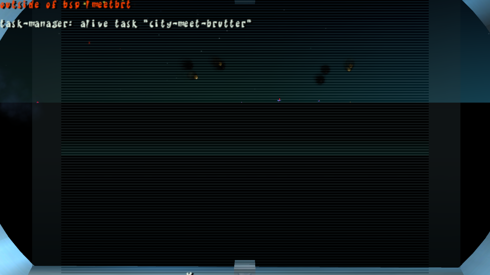
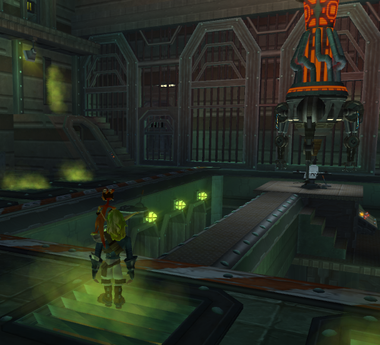
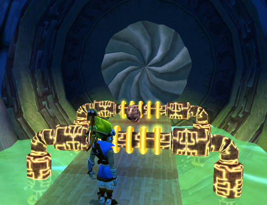
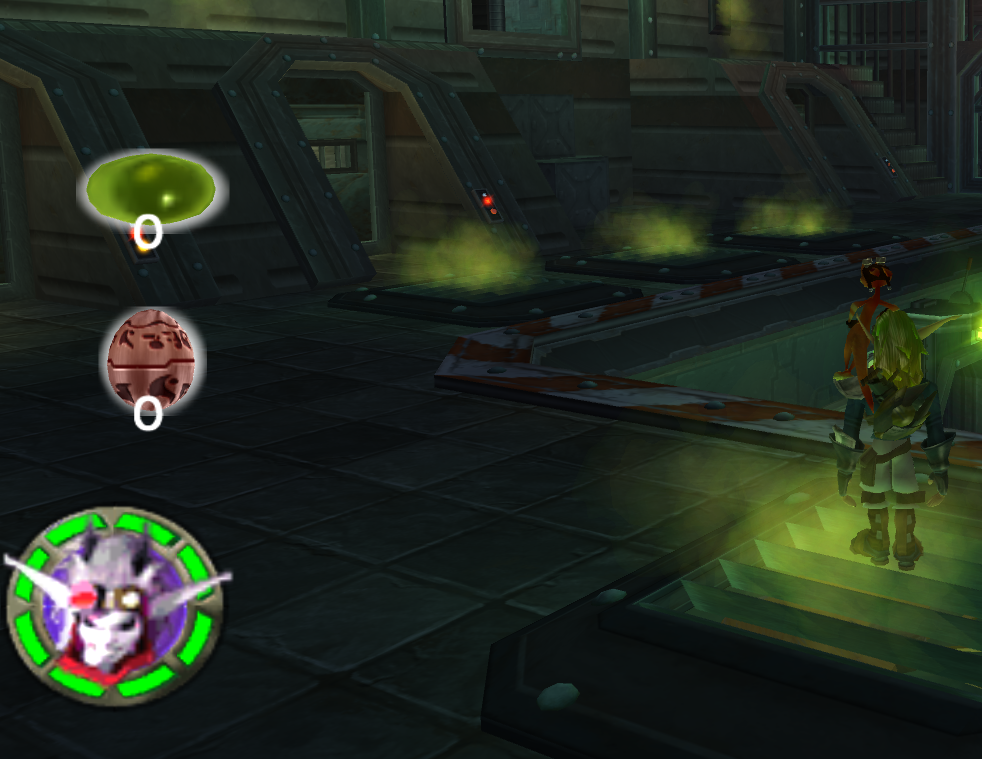

<head>
  <meta name="twitter:card" content="summary_large_image" />
</head>

Work continues on fixing the 0.62 map and improving the install and update experience.
AI patrols are actively being refactored and as such, they have been disabled on live servers for the time being.

<!--truncate-->

## Release Info

This month's DayZ Legacy release is `0.68.00420'.

  

    <LauncherDownloadLink />
  

:::danger
NOTE - When our new InstallShield wizard and launcher are released, they must be used to play the 0.68.69420 update, coming later this month.
:::

## General Changes

### New AI Patrols <PRLink href="https://github.com/open-goal/jak-project/pull/2458"/>

Our first iteration of AI patrols has arrived.
We have only implemented air patrols thus far. Up to two helicopters spawn on server init, with 5 more added over time. Helicopters have a set fly time and are programmed to follow the player - if you see a heli, follow it and wait for it to crash for great loot.

Take note of the following caveats:
- AI do not actually *truly* fire their weapon, instead we create a "cheat" bullet by waiting for a line of sight condition, and calling `createVehicle` for a .380 round at a set velocity and direction.
- AI can actually create their "cheat bullet" while they're looking directly up in the air, so they may look janky when shooting at you.
- AI can actually spawn dead or kill each other after the helicopter crash.
- AI can be killed by zombies, and they do not attack back.
- AI may not actually spawn with a brain at all and get stuck taking their weapon out or putting it behind their back.
- AI patrol simulation applies a significant load to the server and this implementation may not continue to be viable.
- Some items in the AI loadouts may not spawn or appear invisible.

To address some of the most pressing issues with AI while also preventing players from experiencing game-breaking issues, we've disabled AI patrols for now.

A refactor will likely include finding additional overhead on the server through script optimizations, or using an engine-based AI implementation.

### New Trader and Safezone <PRLink href="https://github.com/open-goal/jak-project/pull/2458"/>

Local survivors have designated a safezone on the hill above Cherno. An ATC building and several barricades have been placed. This is the home of our new traders.
The safezone is designated by a 350m radius, and entering this radius will prevent players from shooting or dealing damage.

Right now, zombies can still attack players in the safezone, and you can't really fight back. We're looking at a good solution for this, will probably just have the server delete zombies that stray too close.

You can find traders at this safezone selling all kinds of goods, including weapons, tools, food, and clothing. 

Here are a few things we're still working on with this system:
- Traders spawn in duplicates - you can only interact with the ones who are standing completely still.
- Traders are not properly positioned within the safe zone. Eventually we'll have proper outfits, animations, more clutter, light sources etc.
- You can only purchase items from traders. Selling is not yet implemented, HOWEVER...

Our money system has been integrated in a barebones way. Killing zombies, animals, bots or players will net you a small kill reward. You start with $50.
Eventually the ability to sell items will significantly improve the experience at the trader.

### New Weapons and Attachments <PRLink href="https://github.com/open-goal/jak-project/pull/2469"/>
We continue to port and configure items from the current version of DayZ. 

This latest update includes the following:
- M16A2 (similar to the M4, less attachment compatibility, semi-auto fire mode. Compatible with all STANAGs and CMAGs.)
- Groza SMG (comparable to the PM-73 RAK. Has its' own unique scope, buttstock, and suppressor, not yet configured.)
- Baraka sight (a small profile red-dot sight compatible with most rifles. Requires a 9v battery for reticle.)
- 45rnd AK mag (slightly larger variant of 30rnd 5.45mm AK-based variant mags.)
- Mosin bayonet (attaches to Mosin, obviously. Used to open cans, as a melee weapon, or cool gun decor.)

We have lots of new content currently in development, including the PP-19 Bizon, M249, PKM, SSG-82, SVAL, and CZ550 to name a few.

Proper scope viewport configuration for new scopes like the variable ACOG 6x, or the night vision "Starlight" scopes continue to present a challenge.
We'll continue to work around these challenges by "drip-feeding" this content in the order we have it ready for use.
<ImageCompare left={require("./img/sculptor-before.png").default} right={require("./img/sculptor-after.png").default}/>

## Deadzones

This is a new concept that we're trying - it was initially designed as a band-aid for performance, but we're exploring potential to use these in other ways as well.

Essentially, deadzones are just locations that have an extreme amount of fog. This can be adapted over time to create gas zones, impact the player's temperature, health, and more.

At the moment you'll see some pretty janky stuff with the way the trigger system works. Fog may roll in instantaneously or not at all.

## DirectX 11 Improvements

### Codebase Cleanup <PRLink href="https://github.com/open-goal/jak-project/pull/2457"/>

One of the caveats of decompilation in our case is that method names are unfortunately lost during compilation, so we have to resort to using placeholder names for them until we can figure out their behavior and give them proper names. In the early days of Jak 1, we named our placeholder methods `dummy-[method-id]` or `TODO-RENAME-[method-id]`. In hindsight, this was not a good naming scheme for every single type in the game as it made it incredibly difficult to tell at a glance what type a method call belongs to.

For Jak 2, we rectified this by naming our placeholders after the type, i.e. `type-method-[method-id]`, so we went ahead and did a full pass through the Jak 1 codebase to either give methods proper names where possible or to apply the same naming scheme, making it a lot easier to tell at a glance what type is being used.

A nice bonus of this cleanup work was that a lot of the decompiler improvements that we've added over time also got in, making a good portion of the codebase easier to read and understand.

## Crashes and Stability Issues

### Bigmap <PRLink href="https://github.com/open-goal/jak-project/pull/2460"/>

One of the last significant features that wasn't working was the map in the progress menu. While neither the map nor any icons in the progress menu will render, the underlying file that was decompiled has made the menu fully functional including the save and load screens.

<!-- TODO - no description - https://github.com/open-goal/jak-project/pull/2459 -->

### Disappearing Guards <PRLink href="https://github.com/open-goal/jak-project/pull/2470"/>

See the github description for a more comprehensive write-up. This was one of those annoying and intermittent bugs, and it would cause guards to flicker/disappear as you travelled throughout the city. This has hopefully been solved, but by the nature of these kind of bugs it's hard to know for sure this early on.

### Permamently Disappearing Citizens <PRLink href="https://github.com/open-goal/jak-project/pull/2472"/>

If a citizen was pushed into the border of the nav-mesh, they would permanently disappear.

### Overkilling Enemies <PRLink href="https://github.com/open-goal/jak-project/pull/2475"/>

For the longest time, it was possible to continue to hit enemies after they died. Turned out to be a decompilation mistake.

### Some Text Fixes <PRLink href="https://github.com/open-goal/jak-project/pull/2476"/>

Fixed some issues around the text handling for every language except Korean, fixing many text strings that were being rendered incorrectly.

### Miscellaneous Renderer Fixes <PRLink href="https://github.com/open-goal/jak-project/pull/2488"/>

Some various rendering issues were fixed, including the infamous green ring in the Lost Precursor City.

### Generic and Warp Renderers <PRLink href="https://github.com/open-goal/jak-project/pull/2495"/> <PRLink href="https://github.com/open-goal/jak-project/pull/2515"/> <PRLink href="https://github.com/open-goal/jak-project/pull/2574"/>

This resolved many feature gaps in Jak 2 graphics-wise. Generic was needed for a variety of things, while warp is used for distortions such as the warp-gates or the mirror in the Hip Hog.

This video showcases a small chunk of uses of this effect throughout the game:

<ReactPlayer controls url="https://www.youtube.com/watch?v=-zwhSq-Id4M" className="blog-video"/>

### Shadow Renderer <PRLink href="https://github.com/open-goal/jak-project/pull/2507"/>

Still a work in progress, the shadow renderer is slowly starting to take shape, albeit with its fair share of bugs.

<ReactPlayer controls url="https://www.youtube.com/watch?v=wUB9YsEe5xM" className="blog-video"/>

### Version Diffs <PRLink href="https://github.com/open-goal/jak-project/pull/2528"/>

Jak 2's various versions have been compared and initial support has been added to the tooling. Unlike with Jak 1, Jak 2's versions hardly have any practical difference between them with the only significant bug fix being related to the `Defend Stadium` mission.

The Japanese release does have a bunch of regional changes though, such as removing Jak's goatee and not allowing you to kill civilans in the city, although currently the game's region is hardcoded to NTSC-U.

### Memory Card Support <PRLink href="https://github.com/open-goal/jak-project/pull/2482"/>

Memory card support has been added for Jak 2, meaning you can now save and load your game.

### Faster Elevators and Airlocks <PRLink href="https://github.com/open-goal/jak-project/pull/2478"/> <PRLink href="https://github.com/open-goal/jak-project/pull/2537"/>

Optional hacks have been added which make the airlocks and elevators move / open 50% faster.

### Drawing of 3D HUD Elements <PRLink href="https://github.com/open-goal/jak-project/pull/2527"/>

With the generic renderer being added, the orb and skull gem in the HUD can now be drawn properly. The skull gem requires texture animations which we have not started work on yet, which is why it looks rather static.

### HUD Related Side-mission Crash <PRLink href="https://github.com/open-goal/jak-project/pull/2540"/>

Fixes some crashes that also occurred on the PS3 release. These happen because when you have access to the `city-krew-collection-introduction`, `city-port-run` and `city-save-lurkers` missions, their mission borrow levels `lsack`, `lportrun` and `lmeetbrt` respectively will be loaded no matter where you are in the city. Starting a side mission will temporarily replace that borrow level with `lbbush`, which contains assets and code for side missions including the specific HUD types and graphics, which will be discarded/replaced when the mission is over. However, the side missions involving collecting pickups were being classified as over before their respective HUD elements could be despawned, meaning `lbbush` was being replaced by those other borrow levels, overwriting code for the still-active HUD process and causing the crashes.

TLDR - OpenGOAL and the PS3 releases are too fast!

### Bad Bone Data Issues <PRLink href="https://github.com/open-goal/jak-project/pull/2580"/>

This may not be fixed in the most optimal way yet, but there was an issue in Drill Platform where the `excitement` (which affects the music) would always be maxed. The root cause of this issue was also related to various cutscenes starting from way too far away which was also causing various softlocks and bugs which are now also fixed.

### Overlord <PRLink href="https://github.com/open-goal/jak-project/pull/2544"/>

The PlayStation 2's IOP (Input Output Processor), which was just the PS1's main processor, was cleverly reused on the console to handle most I/O operations.

"Overlord" was Naughty Dog's C library for the IOP and communicated with the Jak games via remote procedure calls in order to load and play audio files such as voice lines and cutscene audio, as well as animation data for cutscenes and other special animations streamed via DVD.

For the longest time, we have been missing the Jak 2 version of the driver which has been the cause of dozens of bugs, but thanks to Ziemas' and water111's hard work at reverse engineering Jak 2's Overlord, we finally have full cutscene audio and voice lines in OpenGOAL! This change alone resolved between 30-40 issues we've been tracking.

<ReactPlayer controls url="https://www.youtube.com/watch?v=r9wqzN5Ut94" className="blog-video"/>

### Aspect Ratio Related Minimap Stretch <PRLink href="https://github.com/open-goal/jak-project/pull/2593"/>

The minimap would be inappropriately stretched based on the aspect ratio. Also happened in the original game when aspect ratio was set to 16x9!

## Other Changes

### REPL Fixes <PRLink href="https://github.com/open-goal/jak-project/pull/2463"/> <PRLink href="https://github.com/open-goal/jak-project/pull/2464"/>

Two fixes involving the REPL were merged.

The first is that if you are using a non-NTSC-v1 version, you can now specify this via the `repl-config.json` file, instead of manually adding conditions to the underlying project definition.

The second is that using relative `project-path` overrides, typically via the `--proj-path` flag, should now function properly.

### CLI shim has been removed from `gk` <PRLink href="https://github.com/open-goal/jak-project/pull/2532"/>

`gk` must now be called with the new CLI format. This is not a concern for anyone other than launcher developers.

### New `defpart` syntax <PRLink href="https://github.com/open-goal/jak-project/pull/2572"/> <PRLink href="https://github.com/open-goal/jak-project/pull/2587"/> <PRLink href="https://github.com/open-goal/jak-project/pull/2596"/>

This still has some issues that need to be worked out, namely:
- The compilation speed is slower in comparison, but trying to be improved.
- Documentation for the new format needs to be written.

But this should hopefully lead to a better understanding of the particle definitions and make them easy to use in the future.

### More efficient divisions <PRLink href="https://github.com/open-goal/jak-project/pull/2585"/>

