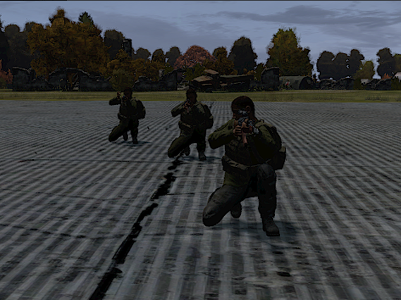
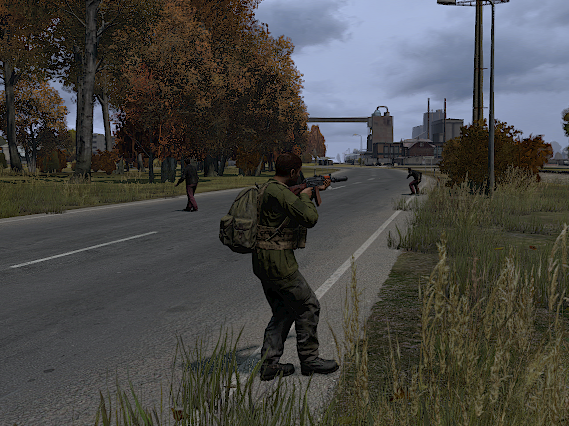
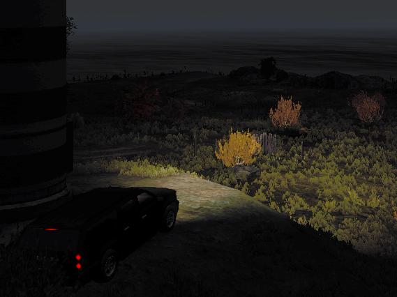
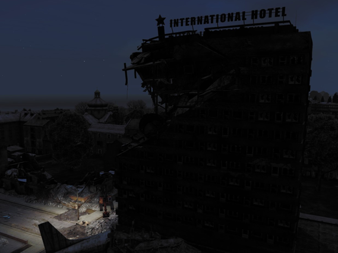
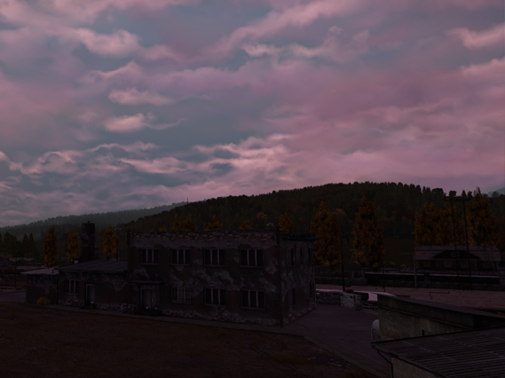

<head>
  <meta name="twitter:card" content="summary_large_image" />
</head>

Making good headway on new content additions and bug fixes/behavior reworks for many major systems.

<!--truncate-->

:::danger
Be aware that you will need to download the latest launcher version manually for this update. 
:::

  

    <LauncherDownloadLink />
  

## Release Info

The new DayZ Legacy release is version `0.69.00400`.

### About our development process...

After this update, we are going to be moving to a quarterly release cycle - this means that we'll be releasing updates every 3 months instead of every month. This will give us more time to work on larger features and content additions, and will also give us more time to test and polish the content we're releasing.

Server uptime and availability won't change and if anything will get much better and more consistent over the next few months. 

We'll still be releasing hotfixes and patches as needed, but the major content updates will be coming every 3 months.

I'm also going to be taking a short break from the project to focus on some other things in my life. In the meantime, the rest of the team continues work in other areas.

Now onto the good stuff! 

## Highlights

### New Bandit AI Implementation 
This is by far the biggest component of this update and one that I'm really excited to push out live.

We've implemented a new AI system for bandits that is much more robust and allows us to do a lot more with them in the future. This system was created mainly by DeltaPony so give them a round of applause! 

  
A note from DeltaPony, our resident Georgian and AI expert

  

"The bots learned how to tactically push the target instead of just sitting like idiots in one spot. Their aiming and firing simulation has become much better and closer emulating that of a real player. We replaced some expensive collision line view calculations with new visbility functions that were used for ARMA AI and this solution is much better at not slowing down the game. We hope that in the future our DayZ-based AI will be used in high tech robots and in the military. Boston Dynamics collaboration soon™"

  

Our old Bandit AI system was very limited due to being implemented entirely in SQF (no, seriously)...

Now that we are performing target aiming and movement calculations in a more direct way, we have a lot more overhead to work with and can do things like:

- Create "military", "civilian", and "aerial" patrols with different behaviors and gear-sets 
- Simulate up to 5 of these patrols across the map with good performance (more to come)
- Dynamically spawn and despawn patrols over the server's lifetime 
- Have the bandits follow static or dynamic paths (exploring towns, guarding helicrashes etc)
- Have bandits react to player actions (shooting, driving)

Right now, for this update, we've enabled a total of 5 patrols across the server's lifetime. This means they don't all spawn at once, but rather spawn and despawn over time based on counts we can set.

We've only enabled certain components of their logic at the moment, so they won't be particularly smart at first.

2 of these patrols are "military", meaning they will be heavily armed and guarding high-tier loot areas. 3 are "civilian", meaning they will have lower-tier gear and patrol around cities and small towns.

This system is going to be prone to a BUNCH of weird behavior and bugs, so please report anything you see that looks off (movement, interaction, balance issues, etc)

The only way we can continue to improve this mechanic is by testing and receiving continuous feedback.

Make sure to look over your shoulder before charging into that barracks...

### World Persistence and Hive Fixes
With this update we are finally enabling world persistence for more object types and certain types of character data. 

- Tents that the user places will now be persistent across restarts. Items inside the tent, including their quantities and any attached items will be saved and available.
- Items that the user drops on the ground will now more reliably save, and their contents and attachments will also be saved. 
- Items in the character's inventory with a "power" or "food_stage" modifier will now be saved properly.
- Character's money will now be saved properly.

We're setting a default lifetime of 2 weeks for all saved objects, and the user will have to manually reset the decay timer before it runs out. 

We've added a "Reset Decay Timer" action to the tent (same spot you'd open or close the main door) that will reset the decay timer for the tent. You can save the tent like this once per server restart.

I've put some basic checks into place that should prevent other players from being able to take down your tent, but the contents are open and accessible to anyone. At the moment, tents cannot be locked, so make sure they are well hidden, or somebody may come along and take your stuff! 

Users can have up to two tents in the world at a time. 

Aside from the brand new persistence functionality, we're also pushing a series of fixes to the hive which SHOULD reduce the frequency in which characters are being randomly reset. 

We'll be monitoring the hive for any issues with this system and will make adjustments to item lifetimes etc as needed.

### Modified Video Options Menu 
We've significantly overhauled the video options menu and added support for a few new options. 

The four new video categories are:
- General 
- Rendering
- Quality 
- Lighting 

You can now directly configure these settings in game: 

- Picture in Picture (basically just textures inside of other textures as a reflection effect)

These options will be coming soon: 
- Water caustics (the effect of light passing through water)
- Particle effects (things like smoke, fire, and explosions)
- Light source count
- Display Mode (new support for borderless fullscreen and exclusive fullscreen modes)
- Output Monitor (useful for those with multiple monitors)

We're still going to be adding new graphical effects in the future, so this list will be expanded over time. We'll continue to organize and move things around as we see fit. 

### More damage improvements 
We've changed the way that shock values are applied across the board and we think this gives a much better experience and challenge overall. Many damage sources were configured with very low or no shock damage assessment, which meant that players could take a lot of damage without any real impact to their character. As part of the changes we've made, you will see a lot more shock damage being applied to your character with almost every damage source. This means that you will be more likely to pass out from taking damage, which is a good thing.

This new application of shock damage also applies to vehicles, so getting into a car crash could have a good chance at knocking you out.  

These changes also apply to zombies, making them much more dangerous than they were previously, so be careful when engaging them in melee combat. We've really upped the shock damage values since the hit detection is so inconsistent. 

Our handling of the unconscious state has been tweaked pretty significantly as well so that you will wake up much quicker than before, in most cases, under two minutes. You will wake up significantly slower if you have broken bones, are bleeding, etc, so keep this in mind. 

This mimics the behavior of the current version of Standalone and we think it's a good balance between the old system and the new system.

### Improved Vehicle Experience 
As mentioned earlier, we've added some damage processing for vehicles, so you'll now go unconscious if you crash into something, and you'll take damage if your helicopter explodes. Eventually we'll expand upon this so that some value of crash damage is applied to the player as well (maybe a fractured leg or other status effect) 

Behind the scenes, we're continuing design for a comprehensive damage and repair system for vehicles, but we're not at a point where it makes sense to enable true damage yet, so we're keeping them (mostly) indestructible for now. However, we have made some other quality-of-life improvements to how vehicles are handled in the world.

We've restored synchronization of the headlight state between the server and client, so now you can turn headlights off/on. Night drivers rejoice!

Vehicles now must have fuel to start, and they will consume fuel as they are driven. The fuel consumption rate is based on the vehicle's speed, so driving at high speeds will consume fuel much faster than driving at low speeds. Previously, vehicles did consume fuel, but stopping the vehicle would automatically refuel it. This is no longer the case, so you'll need to find a jerry can to refuel your vehicle once it's empty. We've increased the frequency in which gas cans spawn and made sure they can be fully filled up at any gas pump. 

We've massively improved the experience for getting out of helicopters. Previously, ejecting from the helicopter would just toss you out straight to the ground, which is a death sentence. Now, you will be able to exit the helicopter and parachute to the ground. Right now, the parachute cannot be steered (coming soon!). You can only open your parachute if you are above 50m in the air, so make sure you're not too close to the ground when you exit the helicopter.

The action name changes from "Eject (Freefall)" to "Eject (Parachute)" when you are above 50m.

The placeholder parachute animation (and all other placeholder animations) are a result of the limited animation set we have to work with on this character skeleton. We might be able to fix this, but at the moment it is what it is and we have our priorities elsewhere. 

Finally, we've forced destruction states to be synchronized from client to server. If a car or helicopter is completely destroyed, it's destroyed for every client. Right now, the only vehicles that are being destroyed are helicopters or planes when crashed at high speed, or when any vehicle enters water.

This resolves a bug that allowed networked players to get into destroyed vehicles and drive/fly them around.

We're making all of these changes now to gear up for vehicle persistence and ownership, which should be coming around in the next couple of months. 

### World and accelerated time improvements 
Welcome to night-time Chernarus! We're testing some improvements to accelerated time and as such, we have set the default server time to early dawn.

Night-time is blazing fast, usually about 30 minutes or less, while day is about 3 1/2 hours.

We've re-enabled street lights so when you're in a town or going down a main road, you should be given at least some light to see by.

To date, we have not been using accelerated time at all, so this is a big step forward for us. A number of reasons we're choosing to make this change now:

- We want players to be using light sources! Not only will this give us helpful performance insights, but we also need to gather some feedback on the overall quality of the lighting system, especially point lights (things like flashlights)
- We have a lot of lighting and HDR bugs we are trying to work on! This will help us identify and fix them.
- We've made some other supporting changes elsewhere to make this transition easier (cars can now use headlights, players spawn with a flashlight, etc) 

This system might cause some issues with weather palettes or in other ways we're not aware of yet, so please report issues if you notice them.

### Sound Improvements 
We've fixed a BUNCH of sounds that weren't firing for one reason or another! Idle zombie groans, splitting ammo, ocean waves, distant gunshots, and animal calls should all be audible now!

This was one issue that never really bothered me until it got fixed, and now I can't imagine playing without them. 

### Volumetric clouds for x64 
We've finished porting volumetric clouds to 64-bit builds, which improves visual quality and brings both the 32-bit and 64-bit DirectX 9 clients in parity with each other.
Next up is support for DirectX 11, which will probably come out with the next update. 

### Multithreading improvements
This latest patch includes a few improvements to multithreading, which should help with performance in some areas and allow the game to take better advantage of your CPU. 

These fixes mostly benefit the server, but we've seen some reduced hitching on CPUs with fewer cores as well.

### Vulkan client fixes
We've changed the way that the Vulkan client behaves when there are more than 2 GPUs to choose between. This should fix crashing issues that were occurring on some systems.

### Loot economy changes 
We've made some slight adjustments here and there, including improved diversity, several fixed spawn types, and a couple of new backpacks to find.

Items should now also be spawning with some amount of damage which is assigned randomly. 

## What build should I use?
The recommended build for this update is the x64 DXVK build. It is selected as the current default in the launcher. This build provides great graphical compatibility, performance, loading speeds, and is the most stable build we have available.

## What's next? 
Here are some things we're prioritizing for the next update. This is not a definitive list, but it should give you a good idea of what we're working on.
- Full vehicle persistence and ownership
- Lockable storage and more types of storage containers
- Lockable doors 
- New weapons: SVAL, AN-94
- Underwater diving (maybe?)
- Chemlights, grenades, flashbangs, and other throwable items
- Better heat isolation and weight handling system for character 
- DirectX 11 improvements
- Additional safezones/deadzones 
- Additional zombie types 

## Full Changelog 
The changelog for this update is available in the #changelog channel on our Discord. 

Thanks for reading and see you in Chernarus!

