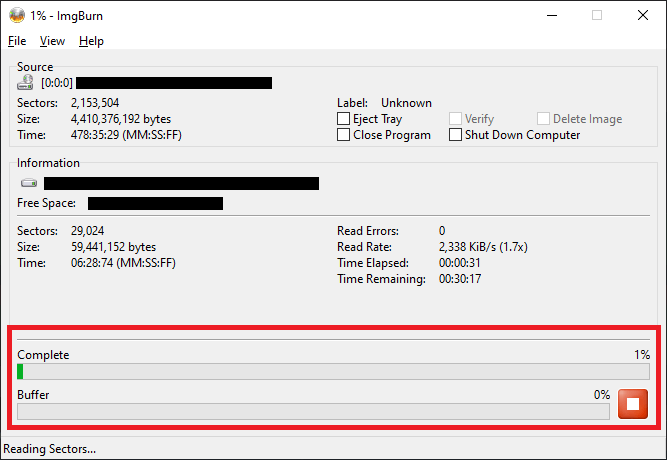

import Requirements from '../partials/_requirements.md';

# Installation

## Opening notes

> Please note that help and support for this project is not always available, as everyone involved is donating their time to this project for free. If this page or the [FAQs](/docs/faq) can't answer your question, you might be able to find help in the DayZ Legacy [discord](https://discord.gg/2JBx9pBKEk), but we do not guarantee support.

At the moment DayZ Legacy is provided as an extremely early build and development is still in progress. There are no timelines for its' completion, as this is a passion project, but you're more than welcome to contribute to its' development with us! See [Contributing](/docs/category/contributing) and [Developing](/docs/category/developing) for more information.

<!-- Additionally, if you'd like to see a video copy of this installation, there is a guide available [on YouTube](https://www.youtube.com/watch?v=p8I9NfuZOgE) that you can follow along with. -->

There are 2 main steps required to setting up DayZ Legacy on your machine, which are:

- Installing the DayZ Legacy Launcher
- Configuring your game settings

Once these steps are complete you'll be able to run DayZ Legacy, connect to our server, and see everything this project has to offer. Follow the instructions below to prepare your installation and start playing!

## Requirements

<Requirements/>

### Windows Specific

:::info
We only officially support Windows 10, and Windows 11.

- Windows 7 has been out of support since January 2020
- Windows 8.1 will be end of life January 2023
:::

You may need to install the [latest 64-bit C++ redistribution](https://aka.ms/vs/17/release/vc_redist.x64.exe).

### Linux Specific

There are no native Linux builds available for DayZ Legacy, but Proton/DXVK have been shown to work with mixed results. We will not provide any support for Wine/Proton environments.

## Step 1: Installing the DayZ Legacy Launcher

### Launcher Pre-requisites

:::danger
You will need your own legitimately obtained copy of the original game. DayZ is available to purchase on Steam for a very affordable price, and it's extremely important to support the developers. 
:::

There are a few requirements that must be satisfied prior to using the launcher.

The first major requirement is a legal Steam license of DayZ Standalone (Arma copies not supported). Having Steam open and being signed into your account is the second requirement. 

You do not need to have the base Steam version of the game installed to play - the launcher will handle the entire process of downloading and updating the game from start to finish. 
The download is about 13GB in total and depending on your location will take some time to complete.

While open, the game runs through Steam and will contribute to your total playtime. 

<!-- The Launcher depends on WebView2, which has been shipping on Windows 10+ since April 2018. If for some reason you still don't have it and have been keeping your PC up to date, you can explicitly download it here https://developer.microsoft.com/en-us/microsoft-edge/webview2/ -->

:::danger
Unfortunately, due to some issues with our launcher design, progress bars may report an inaccurate representation of the total download progress. 

If you have this problem, we're working on a fix. 
:::

### Downloading and Installing

The latest release of the Launcher can be found using the link below.

    

        <LauncherDownloadLink />
    

#### Windows Defender/Antivirus Warnings

The launcher is not a signed application, and by design calls out to our web server to download the needed game files, which may lead to warnings from Microsoft Defender or your antivirus of choice, as installing unsigned applications can be a security risk. This is unfortunately something we can not fix, as signing an application is both expensive and time consuming, and this project is being developed free of charge by a community of volunteers.

<!-- If you trust this application even without the signature, some screenshots of how to pass through the most common warnings can be found below. If you have some technical experience, and would prefer to build this application from the source yourself to avoid these errors, then take a look at the [project README instructions](https://github.com/open-goal/jak-project#setting-up-a-development-environment) instead. Support for this however is outside the scope of this document. -->

  
Expand this section to see examples warnings and ignore them (if you trust this application!)

  

  

If you have properly ignored these warnings and whitelisted the application, the launcher will open and operate as normal.

The first step is to download the DayZ Legacy Launcher and extract the files to the location you would like your game to be installed in. Currently, the launcher does not support the ability to choose your install folder, it will download the files to whatever folder the launcher is currently residing in.

Once the launcher is open, it will notify you that an update is available. Press the Update button and wait for the process to complete. 

  
Expand this section to see step by step instructions for setting up the launcher

  

  

Once it is installed, you'll see a message that says "All files verified successfully!". This means the game is now installed and ready to play. Before you start, it's a good idea to configure your game options. Let's get started on that process.

## Step 2a: Configuring your launcher settings

The game can only be run through the launcher so you will be using it quite frequently. 

We made the decision to tie the game directly into the launcher because:

- You can easily update both the launcher and the game
- Designed for non-technical users
- More useful features in the future

Inside of the launcher, there are several options that the user can configure to ensure the game is running how they want. 

- Game Renderer: This chooses whether the game boots in DirectX 9, DirectX 11, or DXVK mode. This change has a significant impact on the overall visual look and the performance of the game.
  - DirectX 9: Worst performance, best visual accuracy. 
  - DirectX 11: Better performance, worse visual accuracy.
  - Vulkan: Great performance, great visual accuracy. Recommended for users with modern hardware.

- Game Platform: This allows the game to boot in either 32-bit or 64-bit mode. Changing this can have good impacts on loading times but may introduce stability issues or higher system requirements.
  - 64-bit: Improved loading times and stability on most machines, more crashing on some machines. Recommended for most users.
  - 32-bit: The vanilla, standard DayZ Legacy client. Baseline loading times and performance.

- Display Mode: Pretty self explanatory.
  - Windowed: The game runs in a contained window.
  - Fullscreen: The game runs in fullscreen exclusive mode.

- No Logs:
  - Enabled: No logs will be output and the debug console will not be present.
  - Disabled: Game will log out errors and other important information which is useful for developers. This is the recommended setting so that we can trace crashes. There is practically no end-user benefit to turning this on. 

- No Console: 
  - Enabled: This prevents the debug console from being created with the game. This is generally the best option because the debug console is not particularly useful for end users, and when it's disabled, the logs go out to a file instead.
  - Disabled: The debug console will be created at game runtime.

- Run as Administrator:
  - Enabled: This shouldn't be necessary most of the time, but can sometimes solve issues with crashing. Please try enabling it only if your game has been crashing frequently. 

Once these settings have been configured to your preferences, you can simply press the "Save" button, and then you are ready to play the game (by pressing the Play button!)

:::tip 
:::

## Step 2b: Configuring your game settings 

Once you are in game, you will want to make sure you change a couple of in-game settings to your liking. 

You will also need to update your in-game name. You can do this by clicking the "Survivor" text on the main menu screen, deleting it, and typing something else in its' place.  

Once you change your Survivor name and the game settings are configured in the way you'd like, make sure to exit the game and restart it to save all of your changes! 

Once you have restarted the game, you are now ready to play. Go to the Server Browser and look for a DayZ Legacy server to connect to. If there are none listed, please check the #server-status channel in our Discord! Our server uptime historically hasn't been great and there's a chance the server is down for maintenance or some other issue. 

## Conclusion

That's everything! At this point you should have a working copy of the game to play. Join us in the [Discord](https://discord.gg/2JBx9pBKEk) to get involved in the community.

**ENJOY!**
